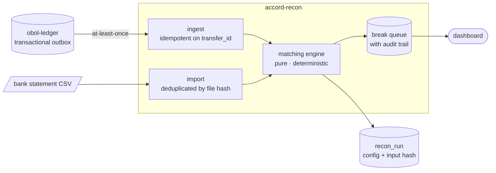

# accord-recon

Reconciliation and break detection for payment ledgers, in Python and FastAPI.

**Live:** <https://accord-recon.onrender.com> — the break queue, with real data from the ledger next door · [API docs](https://accord-recon.onrender.com/docs)

> Free instance, sleeps after 15 minutes idle. Python wakes in a few seconds.

Two systems both claim to know what happened to your money: your ledger, and
your bank. They never quite agree. This service compares them and produces the
thing a finance team actually needs — not a match rate, but a **classified,
prioritised queue of exceptions**: payments the bank never sent, credits the
ledger never recorded, amounts that disagree, duplicates, and settlements that
arrived late.

It consumes settled postings from
[obol-ledger](https://github.com/ankush2001/obol-ledger). The two together are
one system: money moves in Java, and gets verified in Python.

---

## Why matching is the hard part

The naive version is a dictionary keyed on reference. Real data does not
cooperate:

- References arrive mangled — `psp_ch_9f2a41`, `PSP-CH-9F2A41`, ` psp ch 9f2a41 `
- Half the lines have no reference at all
- The bank settles a day or two after the ledger posts
- A processor deducts its fee in transit, so the amounts differ by 29p
- One payout line covers **forty** payments at once
- Three identical £10 payments on Tuesday face three identical £10 statement
  lines on Wednesday, and every pairing is equally plausible

So matching runs in **passes, most certain first**, each pass only allowed to
consume rows no earlier pass claimed:

| Pass | Rule | What it handles |
|---|---|---|
| 1 | duplicates | Flagged *before* matching, so a duplicated line cannot absorb an unrelated payment |
| 2 | `EXACT_REFERENCE` | Both systems name the same payment |
| 3 | `AMOUNT_AND_DATE` | Identical amount inside the settlement window |
| 4 | `WITHIN_TOLERANCE` | Amounts differ by no more than a configured fee |
| 5 | `BATCH_SETTLEMENT` | One payout line, many ledger entries (subset-sum) |
| 6 | classification | Everything left, turned into typed breaks |

Two decisions in there are worth more than the rest.

**A shared reference with different amounts is an amount mismatch, not a
miss.** Both systems have asserted this is the same payment and disagreed about
the money. Reporting it as two unrelated "missing" rows would bury the one fact
that matters.

**Ambiguity is resolved as a minimum-cost assignment, not greedily.** Three
payments against three statement lines are compatible nine ways. Pairing by
iteration order makes the output depend on how the CSV was sorted — and a
reconciliation that changes when you re-sort the input is not a
reconciliation. Each ambiguous cluster is solved exactly, preferring the
assignment that explains the most rows, then the lowest total cost.



---

## What it does with what it finds

A break is not a row in a log. It has a **type**, an amount, a status
(`OPEN → INVESTIGATING → RESOLVED | WRITTEN_OFF`), an assignee, and an
append-only trail of every transition — because *"who wrote this off, when, and
on what grounds"* is the first question asked when a written-off break turns
out to have been a real loss.

Breaks also **survive across runs**. If the same exception is raised again, its
investigation status and assignee carry forward and a counter records how many
runs it has persisted. A break on its eleventh run is a different problem from
one raised this morning, and resetting that every night would throw away an
analyst's work daily.

The queue is ordered by how much money is unexplained, largest first. An
operator with an hour should spend it on the £4,000 exception.

---

## Runs are reproducible

Every run stores the thresholds it used and a SHA-256 of its exact inputs.
Two runs with the same fingerprint must produce identical output — asserted in
the tests.

This is not ceremony. Thresholds change; a run whose thresholds were not
recorded cannot be re-derived, and *"why did March reconcile and April not?"*
becomes unanswerable.

---

## See it work

Both services, end to end:

```bash
docker compose -f ../obol-ledger/docker-compose.yml up -d
OUTBOX_TARGET_URL=http://localhost:8000/v1/ledger/events \
  mvn -f ../obol-ledger/pom.xml spring-boot:run &

uv sync --all-extras
uv run alembic upgrade head
uv run uvicorn accord.main:app --app-dir src --port 8000 &

./scripts/demo.py
```

The demo settles 40 real payments through the ledger, waits for the outbox
relay to deliver them, manufactures a bank statement **with faults deliberately
injected**, reconciles the two, and then checks that every injected fault was
actually reported:

```
3. Manufacture a bank statement, with faults injected
   injected  2  DUPLICATE
   injected  3  MISSING_IN_LEDGER
   injected  2  MISSING_IN_STATEMENT
   injected  3  TIMING_DIFFERENCE

4. Reconcile
   40 ledger vs 43 statement rows
   38 matched, 10 breaks, match rate 91.6%, 5ms

6. Did it find what was broken?
   ok    DUPLICATE: injected 2, reported 2
   ok    MISSING_IN_LEDGER: injected 3, reported 3
   ok    MISSING_IN_STATEMENT: injected 2, reported 2
   ok    TIMING_DIFFERENCE: injected 3, reported 3
```

That last section is the whole point. A demo that prints "10 breaks detected"
proves nothing — it might have found the wrong ten. This one knows exactly what
it broke.

Dashboard at `/`, OpenAPI at `/docs`.

---

## Tests

```bash
uv run pytest        # 61 tests
uv run ruff check .
uv run mypy          # strict
```

The engine is **pure** — no database, no clock, no environment — which is what
makes the interesting tests possible. Four of them are property-based, run over
hundreds of generated inputs, and check the invariants that catch the bugs
nobody thinks to write an example for:

- **No row is ever used twice.** The cardinal sin: explaining one payment with
  two others, so the books appear to balance while money is missing.
- **Every row is either matched or explained.** A row the engine neither
  matched nor raised is a row an operator will never learn about.
- **Matched pairs actually agree**, re-derived from the raw amounts. This is
  what catches a sign error, which otherwise produces a beautifully reconciled
  report of exactly the wrong pairs.
- **Shuffling the input does not change the answer.**

The storage tests use Testcontainers and prove the things that only matter
against a real database: that at-least-once ingestion really is idempotent,
that a run really is reproducible, that break history really carries forward.

---

## Design notes

**No pandas, numpy or scipy.** The obvious reach for a matching engine is
dataframes and `scipy.optimize.linear_sum_assignment`. Neither earns its place:
reconciliation here runs over thousands of rows, not millions, and the
ambiguous clusters that need resolving are almost always two or three
candidates — a size where an exact search in plain Python finishes instantly.
Adding ~90MB of numeric stack to a service that has to fit in a free tier's
memory would be paying a real cost for a theoretical one.

**Decimal, never float.** `float("0.07") * 100` is `7.000000000001` and
truncates to 6 — a penny lost per line. A reconciliation engine that commits
the very error it exists to catch would be worse than none.

**Conclusions are stored apart from inputs.** Matching never writes back onto
the rows it read. If it did, re-running last Tuesday with a corrected tolerance
would be impossible — the inputs would already carry the old run's opinions.

**Pending authorisations are not ingested.** A hold has not moved money, so it
cannot appear on a statement. Ingesting it would manufacture a break that
resolves itself on capture — noise that trains operators to ignore the queue.

**Ingestion is idempotent at the database level.** The ledger's outbox delivers
at-least-once by design, so repeats are expected, not exceptional. A unique
constraint on `(transfer_id, account_code)` absorbs them; a read-then-write
check would let two concurrent deliveries both through.

MIT licensed.
